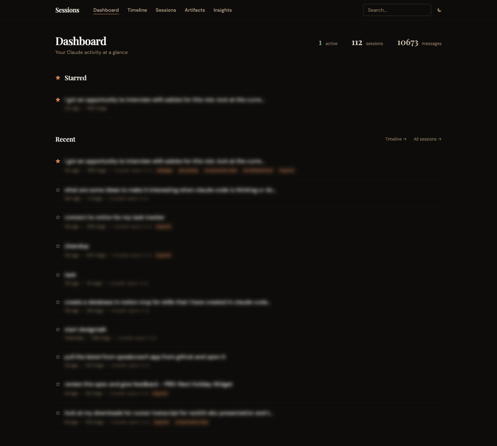
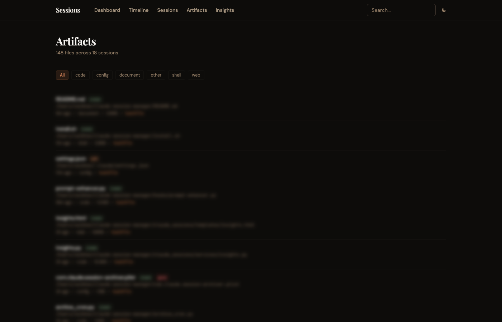

# Claude Session Manager

A web dashboard for viewing and managing your Claude Code terminal sessions.

## Why This App Exists

**If you use Claude Code heavily, you've probably experienced this:**

You're deep in a coding session in one terminal, helping Claude build a feature. You open another terminal for a quick bug fix. Then another for a different project. Hours later, you have 5 terminals open and can't remember:
- Which terminal has your main work?
- What was Claude working on in each session?
- What files did Claude create or modify?
- Where did you leave off on that task from yesterday?

**The core problem:** Claude Code sessions are invisible. You can't see what's running, what happened before, or what Claude produced across all your work.

## What This App Does

Open http://localhost:8080 and instantly see:

| Feature | What You Get |
|---------|--------------|
| **Active Sessions** | See all running Claude sessions across every terminal window, updated in real-time |
| **Session History** | Browse all past sessions with message counts, models used, timestamps |
| **Conversation Viewer** | Read through any session's full conversation - what you asked, what Claude did |
| **Artifacts Browser** | See every file Claude created or modified, across all sessions, filterable by type |
| **Context Export** | Generate a summary to paste into a new session and continue where you left off |
| **Search** | Find any session by searching message content |

## The Real Value

### 1. Never Lose Track of Active Work
The dashboard shows all active sessions with a green indicator. At a glance, you know what's running where.

### 2. Find What Claude Built
The Artifacts page shows every file Claude touched - code, configs, documents, scripts. Filter by type. Click to see which session created it. No more hunting through directories wondering "did Claude make this?"

### 3. Resume Any Session Intelligently
Don't just resume - understand what happened first. Read through the conversation, see pending todos, then export a context summary to continue in a new session with full background.

### 4. Cross-Project Visibility
Native `/resume` shows one project at a time. This dashboard shows everything - all projects, all sessions, one view.

### 5. Works While You Work
Auto-refreshes every 10 seconds. Keep it open in a browser tab as a control panel for all your Claude Code work.

## But Wait, Claude Code Has Native Session Management

Yes! And you should use it:

| Native Feature | Command |
|----------------|---------|
| Resume last session | `claude --continue` |
| Resume by name | `claude --resume <name>` |
| Interactive picker | `claude --resume` |

**Use native commands for:** Quick session resumption within a single project.

**Use this dashboard for:** Cross-project visibility, finding what Claude built, understanding session history before resuming, keeping track of multiple active terminals.

They complement each other.

## Quick Start

```bash
git clone https://github.com/abhitsian/claude-session-manager.git
cd claude-session-manager
pip install -r requirements.txt
python -m uvicorn claude_sessions.main:app --reload --port 8080
```

Open http://localhost:8080

## Screenshots

### Dashboard


### Artifacts


## Features

### Dashboard
- Active sessions with real-time status (auto-refreshes)
- Stats: total sessions, messages, token usage
- Recent sessions with quick access

### Session Browser
- All sessions, paginated
- Search by content
- Filter by active/inactive

### Conversation Viewer
- Full message history
- Tool call indicators
- Collapsible thinking blocks

### Artifacts Browser
- All files Claude created/modified
- Filter by type (code, document, config, web, shell)
- See which session created each file
- Check if file still exists

### Context Export
Generate a markdown summary for continuing work:
- Session metadata
- Work summary
- Pending todos
- Recent conversation
- One-click copy to clipboard

## How It Works

Reads directly from `~/.claude/` (read-only):
- `projects/{project}/{sessionId}.jsonl` - Conversation history
- `debug/latest` - Active session detection
- `stats-cache.json` - Usage statistics
- `todos/{sessionId}.json` - Task lists

No database. No data sent anywhere. Just reads your local Claude Code files.

## Tech Stack

- **Backend**: Python, FastAPI
- **Frontend**: Jinja2, Tailwind CSS, HTMX
- **Data**: Direct JSONL/JSON parsing

## License

MIT
