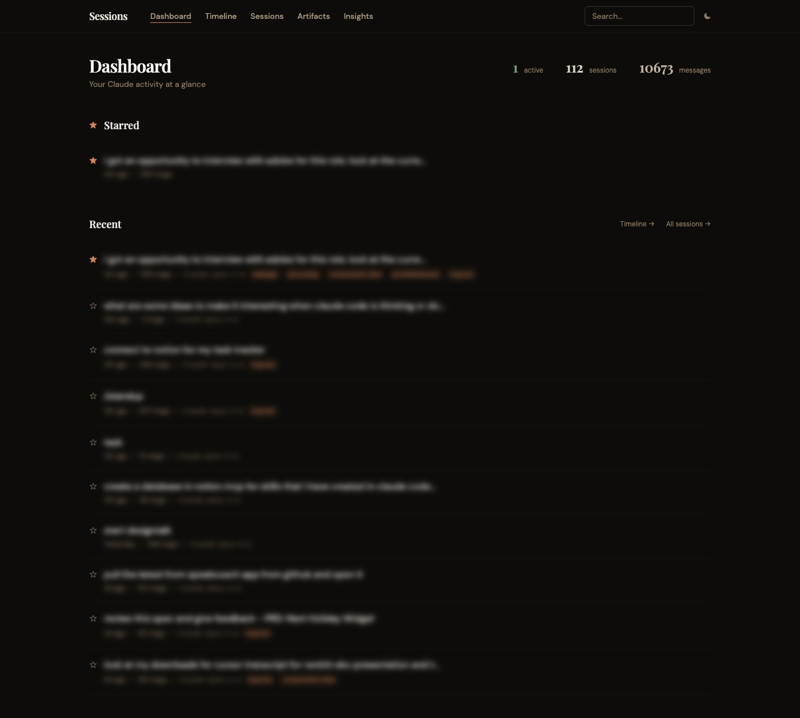
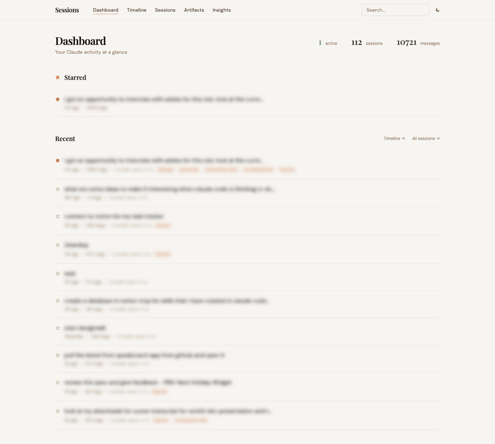
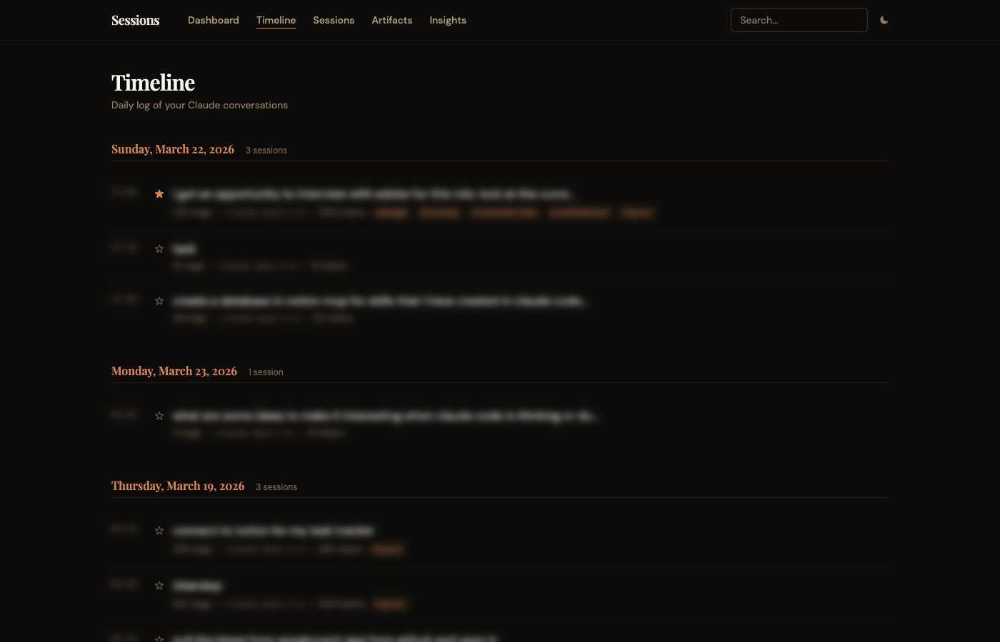
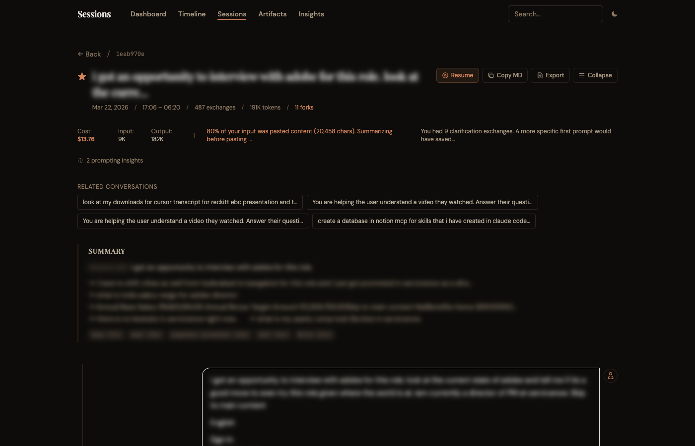
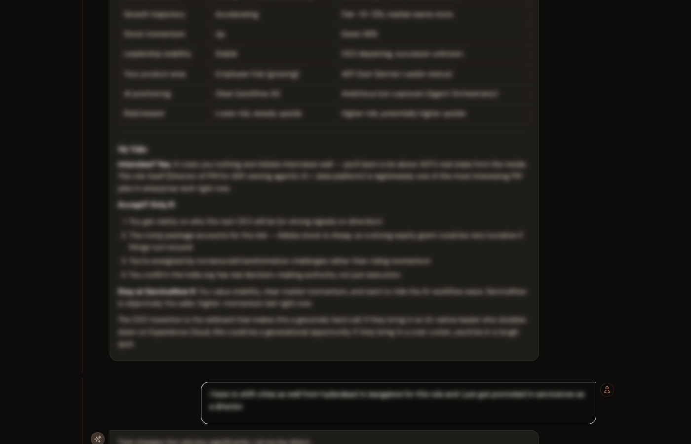
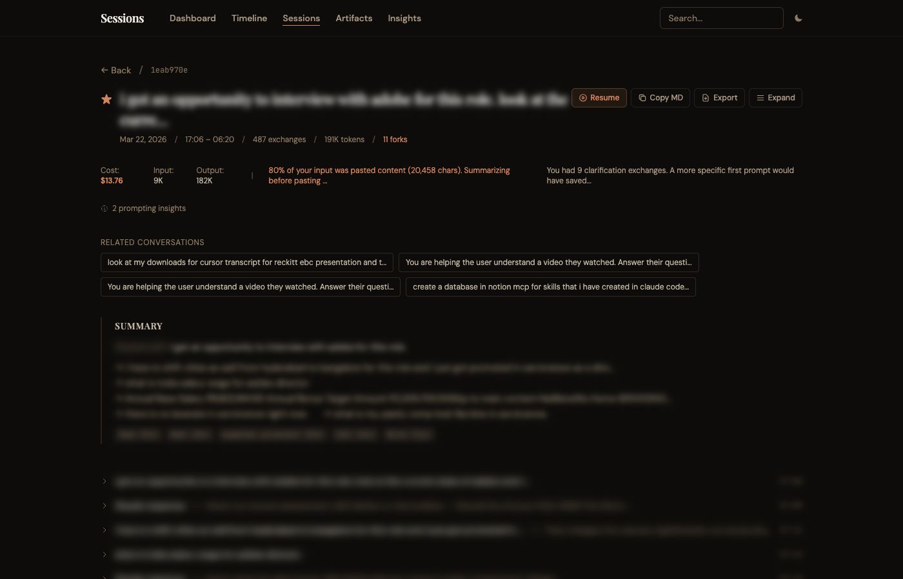
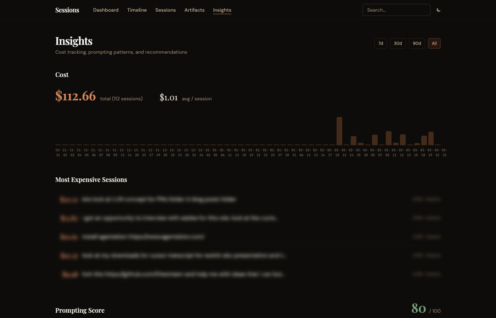
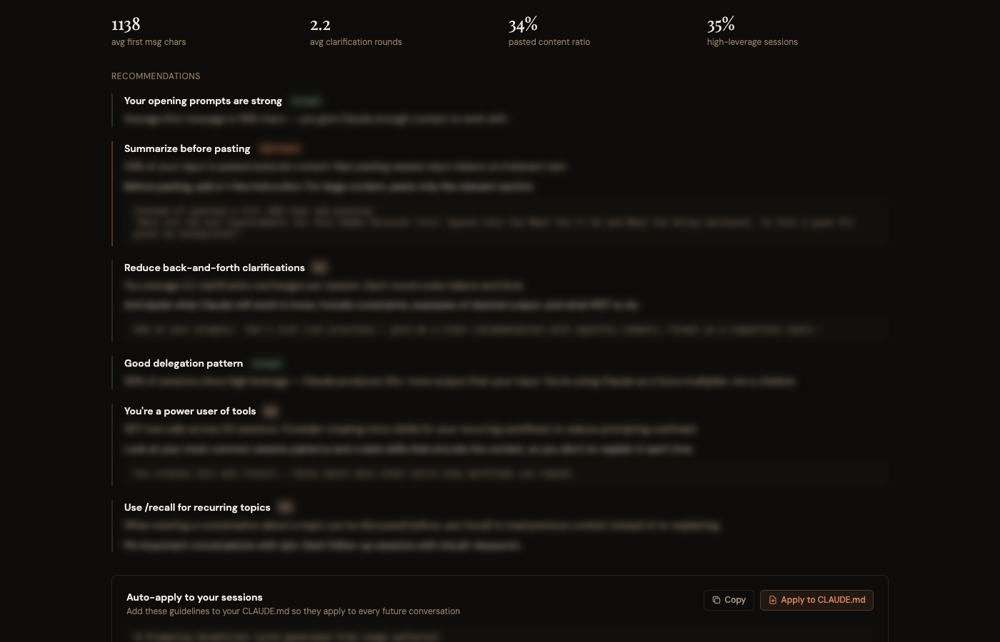
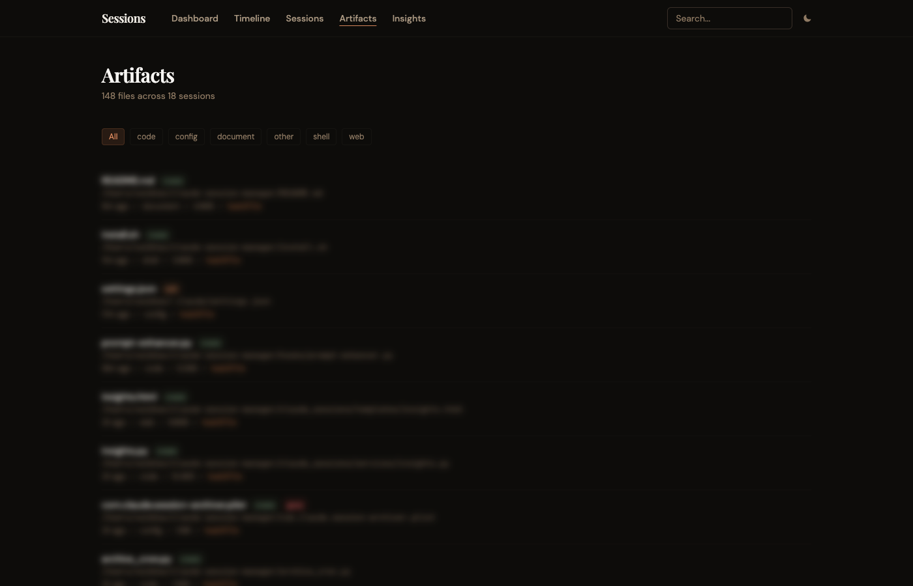

# Claude Desk

The UI for Claude Code.

## Why This Exists

Every chat interface has the same fundamental problems. Nobody is fixing them.

**Chat is linear. Your thinking isn't.** You start at the top, you end at the bottom. If you want to explore a different direction halfway through, you either pollute the current thread or start over and lose all context. When you're deep in an analysis — evaluating a job offer, designing a system, debugging a problem — you want to explore the comp angle, then go back and explore the career trajectory angle, then compare both. Today you're forced to do this sequentially in one thread, where each tangent degrades the context for everything else. Or you start three separate chats and manually carry context between them. Neither works.

**Chat systems don't make you better at using them.** A tool like Claude Code is exactly as powerful as the person using it. A great prompt gets a great response. A vague prompt gets a generic response that costs the same amount of money. But nobody is tracking this. Nobody is telling you that your average first message is 40 characters and that sessions where you write 200+ characters need 40% fewer follow-ups. Nobody is pointing out that you paste 7,000 characters of raw content when the relevant 500 would get a better answer at 1/14th the cost. There's no feedback loop. You use the tool the same way on day 300 as day 1. The tool gets more capable with every model update, but you don't get more capable at using it.

**Conversations are disposable.** Claude Code deletes your sessions after 30 days. The analysis you spent an hour building, the decision you carefully reasoned through, the research Claude did across 15 web searches and 8 tool calls — gone. You're left with the outcome but the reasoning that got you there evaporates. This matters because knowledge work is cumulative. The comp analysis from January informs the negotiation in March. The architectural decision from last quarter is the context for this quarter's refactor. When your conversations disappear, you lose the connective tissue between your decisions.

**You can't find anything.** You had a conversation about deployment issues two weeks ago. Which session was it? You've had 60 sessions since then. Basic keyword search won't help when you remember the concept but not the exact words. And even if search finds the right session, you're dumped at the top of a 200-message thread with no idea where the relevant discussion happened.

Claude Desk fixes all of these.

## What Claude Desk Does

### Layer 1: Permanent Record

Every conversation you've ever had, searchable and browsable forever. Claude Code deletes files after 30 days — Claude Desk's daily cron archives them to SQLite before that happens. Timeline view going back to your first session.

### Layer 2: Conversation Intelligence

- Chat-style viewer with collapsible threads — collapse a 400-message session into 15 one-line summaries, expand just the one you need
- **Topic extraction within sessions** — detects topic shifts mid-conversation, labels each discussion block, and lets you deep-link directly to where a topic was discussed
- **Topic-based timeline** — instead of just listing sessions by day, groups discussions by what you talked about across all sessions, with domain tags (code, career, product, writing, analysis, planning)
- Auto-generated titles, summaries, and topic extraction — no more scanning UUIDs
- Fork from any message to explore a different direction without polluting the original
- Related sessions detected by topic overlap — "you discussed this before in these 3 sessions"
- Pasted content detection — knows when you shared a job posting vs. comp data vs. an email

### Layer 3: Semantic + Keyword Search

Two search engines working together:

- **Semantic search** — powered by [fastembed](https://github.com/qdrant/fastembed) with BAAI/bge-small-en-v1.5 embeddings (384 dimensions, no PyTorch dependency). Ask "what did Claude recommend about my career" and find results even when those exact words don't appear in the conversation. Sub-millisecond cosine similarity over 5,000+ message chunks stored as numpy arrays.
- **Keyword search** — SQLite FTS5 with BM25 ranking, searching across all live and archived sessions.
- **Hybrid ranking** — results combine 60% semantic similarity + 40% keyword match for best-of-both-worlds. Each result shows whether it matched by meaning, keywords, or both.
- **Natural language queries** — strips preamble from questions like "when did I discuss X" or "find me conversations about Y" before searching.
- **Message-level results with deep links** — search returns individual messages, not just sessions. Click a result and land directly on the exact message where that topic was discussed, with a highlight animation.
- **Full conversation content indexed** — every user and assistant message across all sessions, including archived ones whose JSONL files were deleted months ago.

### Layer 4: Cost Intelligence

Per-session cost breakdown, daily trends, most expensive sessions ranked. Know exactly what each conversation cost, see where the money goes, and whether you're getting more efficient over time.

### Layer 5: Prompting Coach

Claude Desk analyzes your actual prompting patterns across all sessions and generates:

- A **prompting score** (0-100) based on first-message quality, clarification frequency, paste ratio, and leverage
- **Personalized recommendations** with before/after examples from your own sessions — not generic tips
- **Trend tracking** — score and metrics compared against the previous equivalent period, so you can see if you're improving (e.g., "your clarification rounds dropped by 1.2 vs last 7 days")
- **Time-window reactive** — recommendations refresh based on the selected period (7d / 30d / 90d / all), analyzing only sessions within that window
- A **CLAUDE.md playbook** you apply with one click — these rules become part of every future Claude session, making Claude adapt to your style automatically
- A **prompt enhancer hook** that runs on every message, warning you before you send a vague or wasteful prompt

### Layer 6: Skills & Artifacts

- **Skills browser** — catalogs every slash command and skill from your user config, plugins, and marketplace. See what's available, read full documentation, filter by source.
- **Artifacts browser** — every file Claude created or modified across all sessions, filterable by type (code, config, document, image) and session.
- **3D visualizations** — terrain map and constellation scatter of your session data.

### The Self-Learning Loop

This is what makes it more than a UI:

```
You prompt Claude
  → Hook checks: vague? pasted content? topic you've covered before?
  → Claude reads your CLAUDE.md rules (generated from your patterns)
  → Session gets archived + analyzed
  → Insights engine updates your prompting score
  → Playbook refines → CLAUDE.md evolves
  → Next session: Claude is better tuned to how you work
```

Claude Code gets smarter about YOU over time. Not because Anthropic built it — because your own usage data creates a feedback loop that shapes every future interaction.

## Install

```bash
curl -fsSL https://raw.githubusercontent.com/abhitsian/claude-desk/main/get.sh | bash
```

That's it. This:
- Clones to `~/.claude-desk`
- Installs Python dependencies (including fastembed for semantic search)
- Sets up the dashboard server (auto-starts on login, always running)
- Sets up the daily archiver (runs at 3 AM, saves expiring sessions)
- Archives all your current sessions
- Opens the dashboard at http://localhost:8080

After install, go to Sessions > click **Build index** to enable semantic search (one-time, ~30 seconds).

## Screenshots

### Dashboard


### Dashboard (Light Mode)


### Timeline


### Session Detail


### Chat-Style Conversation Viewer


### Collapsible Threads


### Insights & Cost Tracking


### Prompting Score & Recommendations


### Artifacts Browser


## Features

| Feature | Description |
|---------|-------------|
| **Dashboard** | Active, starred, and recent sessions at a glance |
| **Timeline (Topic View)** | Sessions grouped by topic clusters per day, with domain tags and deep links |
| **Timeline (Session View)** | Classic chronological view with inline topic pills |
| **Semantic Search** | Natural language search using fastembed embeddings (bge-small-en-v1.5) |
| **Keyword Search** | SQLite FTS5 with BM25 ranking across live + archived sessions |
| **Hybrid Search** | Combined semantic (60%) + keyword (40%) scoring for best results |
| **Message-Level Results** | Search returns individual messages with deep links to exact location |
| **NL Query Preprocessing** | Strips "when did I discuss..." preamble — just type naturally |
| **Topic Extraction** | Detects topic shifts within sessions, labels discussion blocks |
| **Topic Clustering** | Groups related topics across sessions within each day |
| **Conversation Viewer** | Chat-style layout, markdown rendering, collapsible threads |
| **Auto Titles** | Sessions named from first message, not UUIDs |
| **Favorites** | Star sessions for quick access |
| **Fork** | Branch from any message to explore a different direction |
| **Resume** | One click to open Terminal and resume any session |
| **Export** | Copy or download any conversation as markdown |
| **Cost Tracking** | Per-session cost, daily trends, most expensive sessions |
| **Prompting Score** | 0-100 score based on your actual usage patterns |
| **Trend Tracking** | Score deltas vs previous period — see if you're improving |
| **Recommendations** | Personalized tips with before/after examples, reactive to time window |
| **CLAUDE.md Playbook** | One-click apply learned rules to every future session |
| **Prompt Hook** | Real-time analysis before your prompt reaches Claude |
| **Permanent Archive** | Daily cron saves sessions before Claude Code deletes them |
| **Pasted Content Detection** | Identifies job postings, comp data, emails, webpages |
| **Related Sessions** | Topic-based linking across conversations |
| **Conversation Summaries** | Auto-generated overview of what was discussed |
| **Skills Browser** | All slash commands and skills from user config + plugins |
| **Artifacts Browser** | Every file Claude created or modified, filterable |
| **Visualizations** | 3D terrain and constellation scatter of session data |
| **Light/Dark Mode** | Toggle between warm dark and cream light themes |

## How It Works

### Data Architecture

```
~/.claude/
├── projects/{project}/{sessionId}.jsonl    ← Live sessions (Claude manages, deletes after ~30 days)
├── history.jsonl                           ← Prompt history (all sessions ever, kept by Claude)
├── session-archive.db                      ← Permanent archive (Claude Desk manages)
├── session-search.db                       ← FTS keyword index (Claude Desk manages)
├── session-favorites.json                  ← Starred sessions
└── semantic-index/                         ← Embedding vectors (Claude Desk manages)
    ├── embeddings.npy                      ← numpy array of message embeddings (384 dims)
    ├── metadata.json                       ← Chunk-to-message mapping with UUIDs
    └── index_state.json                    ← Index freshness tracking
```

- The dashboard reads JSONL files directly (read-only, never modifies Claude's data)
- The daily cron archives sessions older than 25 days to SQLite before Claude deletes them
- Deleted sessions are served from the archive transparently
- `history.jsonl` provides metadata for sessions that were deleted before archiving existed
- Semantic index embeds message chunks using BAAI/bge-small-en-v1.5 via fastembed (ONNX runtime, no PyTorch)
- All data stays local — nothing leaves your machine

### Search Architecture

```
User query: "what did Claude recommend about my career"
  │
  ├── NL Preprocessing
  │   └── Strips to: "Claude recommend career"
  │
  ├── Semantic Path (60% weight)
  │   ├── Embed query → 384-dim vector
  │   ├── Cosine similarity against all message chunks
  │   └── Top matches by meaning (even without keyword overlap)
  │
  ├── Keyword Path (40% weight)
  │   ├── FTS5 MATCH with BM25 ranking
  │   ├── Search live sessions + archived messages
  │   └── Highlighted snippets with context
  │
  └── Hybrid Merge
      ├── Weighted combination of both scores
      ├��─ Deduplicate by message UUID
      └── Return ranked results with deep links (#msg-{uuid})
```

## Tech Stack

- **Backend**: Python, FastAPI, SQLite (FTS5), numpy
- **Embeddings**: fastembed (ONNX runtime) with BAAI/bge-small-en-v1.5
- **Frontend**: Jinja2, Tailwind CSS, HTMX, marked.js
- **Design**: Editorial aesthetic — Playfair Display + DM Sans, copper/ink palette
- **No external services**: Everything runs locally, no data leaves your machine

## Who It's For

Anyone who uses Claude Code as their daily driver — not for one-off questions but as a core productivity tool. PMs, engineers, researchers, founders who have 20+ sessions a week and want to see where their money goes, find what they've discussed before, and get better at using Claude without thinking about it.

## Uninstall

```bash
launchctl unload ~/Library/LaunchAgents/com.claude.desk.plist
launchctl unload ~/Library/LaunchAgents/com.claude.desk-archiver.plist
rm -rf ~/.claude-desk
```

Your archive data stays in `~/.claude/session-archive.db` and `~/.claude/semantic-index/` until you delete them.

## License

MIT
